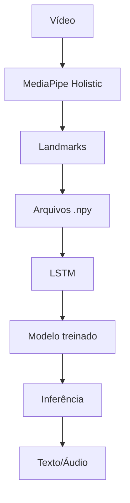

# Gesto.AI

**Sistema Inteligente de Reconhecimento de Gestos da Língua Brasileira de Sinais (Libras) utilizando Visão Computacional e Deep Learning.**

O Gesto.AI é um projeto experimental e acadêmico voltado ao reconhecimento automático de gestos isolados em Libras. A implementação atual utiliza webcam, MediaPipe Holistic, extração de landmarks, sequências NumPy (`.npy`) e uma rede neural LSTM em PyTorch para classificar sinais previamente definidos.

O projeto está em fase de validação técnica: o pipeline de coleta, extração, treinamento, avaliação e inferência já funciona, mas os resultados ainda são limitados pelo tamanho reduzido do dataset.

## Problema

A Língua Brasileira de Sinais é essencial para a comunicação e inclusão de pessoas surdas no Brasil. Apesar disso, muitas interações cotidianas ainda são dificultadas pela baixa fluência em Libras por parte da população em geral.

Essa barreira cria desafios em situações sociais, educacionais, profissionais e de atendimento, especialmente quando uma pessoa surda precisa se comunicar com alguém que não domina Libras.

Sistemas baseados em Inteligência Artificial podem auxiliar nesse cenário ao reconhecer padrões visuais de gestos e traduzi-los, futuramente, para saídas textuais ou sonoras. O Gesto.AI explora essa possibilidade a partir de Visão Computacional e Redes Neurais Profundas, começando por sinais isolados em ambiente controlado.

## Objetivos

### Objetivo Geral

Desenvolver um sistema inteligente capaz de reconhecer gestos isolados em Libras a partir de vídeo, utilizando landmarks corporais e de mãos como representação temporal para classificação por Deep Learning.

### Objetivos Específicos

- Capturar vídeos de gestos por webcam.
- Detectar landmarks de mãos e pose corporal com MediaPipe.
- Converter vídeos em sequências numéricas padronizadas.
- Treinar um modelo LSTM para classificação de gestos isolados.
- Executar inferência em tempo real ou por captura manual via webcam.
- Preparar o projeto para futura conversão dos gestos reconhecidos em texto e voz.
- Expandir gradualmente o vocabulário de sinais reconhecidos.

## Arquitetura Geral



> Observação: a saída em texto/áudio faz parte da visão do projeto. A implementação atual exibe a predição na tela; a síntese de voz ainda não está implementada no pipeline principal.

## Tecnologias Utilizadas

| Tecnologia | Função no projeto |
| --- | --- |
| Python 3.11 | Linguagem principal do projeto e dos scripts de pipeline. |
| OpenCV | Captura de webcam, leitura/gravação de vídeos e interface visual de inferência/coleta. |
| MediaPipe | Extração de landmarks de mãos e pose corporal usando MediaPipe Holistic. |
| PyTorch | Definição, treinamento, salvamento e carregamento do modelo LSTM. |
| NumPy | Armazenamento e manipulação das sequências de landmarks em arquivos `.npy`. |

## Estrutura do Projeto

```text
gesto-AI/
├── data/
│   ├── annotations/
│   ├── interim/
│   ├── processed/
│   └── raw/
├── docs/
├── models/
│   └── checkpoints/
├── notebooks/
├── reports/
│   └── metrics/
├── scripts/
├── src/
│   ├── config/
│   ├── datasets/
│   ├── evaluation/
│   ├── inference/
│   ├── models/
│   ├── preprocessing/
│   ├── training/
│   └── vision/
├── tests/
├── requirements.txt
├── setup_windows.ps1
└── README.md
```

| Diretório/arquivo | Responsabilidade |
| --- | --- |
| `data/raw/videos/` | Armazena vídeos brutos organizados por classe. |
| `data/annotations/` | Contém `labels.csv` e `classes.json`. |
| `data/interim/landmarks_raw/` | Armazena sequências `.npy` extraídas dos vídeos. |
| `data/processed/` | Reservado para dados processados em fases futuras. |
| `models/checkpoints/` | Armazena o checkpoint treinado do modelo LSTM. |
| `reports/metrics/` | Armazena relatórios de treino e avaliação. |
| `scripts/` | Contém os comandos executáveis do pipeline. |
| `src/config/` | Centraliza caminhos e hiperparâmetros. |
| `src/datasets/` | Carrega e valida o dataset de landmarks. |
| `src/evaluation/` | Calcula métricas e salva relatórios. |
| `src/inference/` | Contém utilitários de carregamento de checkpoint. |
| `src/models/` | Define a arquitetura LSTM. |
| `src/preprocessing/` | Contém funções de padding/truncamento de sequências. |
| `src/training/` | Contém split de treino/validação e loop de treino. |
| `src/vision/` | Contém extração de landmarks com MediaPipe. |
| `setup_windows.ps1` | Recria o ambiente Python no Windows. |

## Pipeline de Dados

### Coleta

Script:

```powershell
.\venv\Scripts\python.exe -m scripts.capture_data --label oi --samples 20 --duration 3
```

Entrada:

- webcam;
- nome da classe (`--label`);
- quantidade de amostras (`--samples`);
- duração por vídeo (`--duration`);
- índice da câmera (`--camera`, opcional).

Saída:

- vídeos em `data/raw/videos/{label}/`;
- registros em `data/annotations/labels.csv`.

O script faz contagem regressiva, exibe instruções na tela, usa nomes incrementais (`oi_001.mp4`, `oi_002.mp4`) e evita sobrescrever vídeos existentes.

### Extração de Landmarks

Script:

```powershell
.\venv\Scripts\python.exe -m scripts.extract_landmarks
```

Entrada:

- vídeos descritos em `data/annotations/labels.csv`;
- arquivos em `data/raw/videos/{label}/{sample_id}.mp4`.

Saída:

- arquivos `.npy` em `data/interim/landmarks_raw/{label}/{sample_id}.npy`.

Cada `.npy` contém uma sequência temporal de frames, onde cada frame possui 258 features.

### Treinamento

Script:

```powershell
.\venv\Scripts\python.exe -m scripts.train_lstm
```

Entrada:

- sequências `.npy`;
- classes com dados reais;
- configurações em `src/config/settings.py`.

Saída:

- checkpoint completo em `models/checkpoints/lstm_gesture_model.pt`;
- relatórios em `reports/metrics/`.

O treino usa split treino/validação quando há dados suficientes. Com dataset pequeno, o projeto usa fallback técnico e registra aviso explícito de que as métricas não representam generalização.

### Avaliação

Script:

```powershell
.\venv\Scripts\python.exe -m scripts.evaluate_model
```

Entrada:

- checkpoint completo;
- dataset de landmarks disponível.

Saída:

- métricas em JSON;
- matriz de confusão em CSV;
- resumo textual da avaliação.

### Inferência

Modo com captura manual:

```powershell
.\venv\Scripts\python.exe -m scripts.run_capture_inference
```

Modo contínuo com janela deslizante:

```powershell
.\venv\Scripts\python.exe -m scripts.run_realtime_inference
```

Entrada:

- webcam;
- checkpoint treinado;
- landmarks extraídos frame a frame.

Saída:

- classe prevista exibida na tela;
- confiança da predição.

O modo `run_capture_inference` é mais adequado para o MVP atual, pois reduz a mistura de repouso, transição e gesto em uma mesma janela.

## Dataset Atual

O dataset é organizado por classe:

```text
data/raw/videos/{label}/{sample_id}.mp4
data/interim/landmarks_raw/{label}/{sample_id}.npy
```

Formato atual do `labels.csv`:

```csv
sample_id,label,path
oi_001,oi,data/raw/videos/oi/oi_001.mp4
```

O arquivo `classes.json` define o vocabulário planejado:

```json
{
  "0": "oi",
  "1": "tchau",
  "2": "sim",
  "3": "nao",
  "4": "obrigado",
  "5": "por_favor",
  "6": "ajuda",
  "7": "agua",
  "8": "bom_dia",
  "9": "desculpa"
}
```

| Classe | Status atual |
| --- | --- |
| `oi` | Possui dados iniciais |
| `tchau` | Possui dados iniciais |
| `sim` | Possui dados iniciais |
| `nao` | Possui dados iniciais |
| `obrigado` | Possui dados iniciais |
| `por_favor` | Em expansão |
| `ajuda` | Em expansão |
| `agua` | Em expansão |
| `bom_dia` | Em expansão |
| `desculpa` | Em expansão |

No estado atual, cada uma das cinco classes com dados possui apenas uma amostra. Isso é suficiente para validar o pipeline, mas insuficiente para avaliação científica robusta.

## Representação dos Dados

Cada frame extraído pelo MediaPipe é convertido em um vetor numérico de 258 features:

| Região | Cálculo | Total |
| --- | ---: | ---: |
| Mão esquerda | 21 landmarks × 3 coordenadas (`x`, `y`, `z`) | 63 |
| Mão direita | 21 landmarks × 3 coordenadas (`x`, `y`, `z`) | 63 |
| Pose corporal | 33 landmarks × 4 valores (`x`, `y`, `z`, `visibility`) | 132 |
| Total | 63 + 63 + 132 | 258 |

As sequências possuem número variável de frames. Durante o carregamento do dataset, elas são padronizadas para 100 frames por padding ou truncamento.

Formato usado pelo modelo:

```text
(batch, 100, 258)
```

## Modelo de IA

A arquitetura atual é uma rede LSTM implementada em PyTorch.

Entrada:

```text
(batch, 100, 258)
```

Camada LSTM:

```text
input_size = 258
hidden_size = 128
num_layers = 2
dropout = 0.2
```

Classificador:

```text
128 → 64 → num_classes
```

Fluxo de treinamento:

1. Carrega sequências `.npy`.
2. Padroniza cada sequência para 100 frames.
3. Filtra classes sem amostras reais.
4. Cria split treino/validação quando possível.
5. Treina a LSTM com `CrossEntropyLoss`.
6. Salva checkpoint completo com pesos, classes, configuração, histórico e métricas.

## Como Instalar

### 1. Instalar Python 3.11

Opção com `winget`:

```powershell
winget install Python.Python.3.11
```

Ou baixe pelo site oficial:

```text
https://www.python.org/downloads/
```

Valide:

```powershell
py -3.11 --version
```

### 2. Setup automático no Windows

Na raiz do projeto:

```powershell
.\setup_windows.ps1
```

O script:

- remove o `venv` antigo;
- cria um novo ambiente virtual;
- atualiza `pip`;
- instala `requirements.txt`;
- valida `numpy`, `cv2`, `mediapipe` e `torch`.

Se o PowerShell bloquear scripts locais:

```powershell
Set-ExecutionPolicy -Scope CurrentUser RemoteSigned
```

### 3. Instalação manual

```powershell
Remove-Item -Recurse -Force .\venv
py -3.11 -m venv venv
.\venv\Scripts\python.exe -m pip install --upgrade pip
.\venv\Scripts\python.exe -m pip install -r requirements.txt
```

### 4. Validar ambiente

```powershell
.\venv\Scripts\python.exe -c "import numpy, cv2, mediapipe, torch; print('ambiente ok')"
```

O diretório `venv/` é local e não deve ser versionado.

## Como Executar

### Coleta

```powershell
.\venv\Scripts\python.exe -m scripts.capture_data --label oi --samples 20 --duration 3
```

Criar nova classe explicitamente:

```powershell
.\venv\Scripts\python.exe -m scripts.capture_data --label novo_sinal --samples 20 --duration 3 --create-label
```

### Extração

```powershell
.\venv\Scripts\python.exe -m scripts.extract_landmarks
```

### Treino

```powershell
.\venv\Scripts\python.exe -m scripts.train_lstm
```

### Avaliação

```powershell
.\venv\Scripts\python.exe -m scripts.evaluate_model
```

### Inferência

Captura manual:

```powershell
.\venv\Scripts\python.exe -m scripts.run_capture_inference
```

Inferência contínua:

```powershell
.\venv\Scripts\python.exe -m scripts.run_realtime_inference
```

## Relatórios Gerados

Diretório:

```text
reports/metrics/
```

| Arquivo | Propósito |
| --- | --- |
| `training_metrics.json` | Histórico de treino, métricas finais, split e avisos do dataset. |
| `training_confusion_matrix.csv` | Matriz de confusão calculada na validação técnica. |
| `training_summary.txt` | Resumo textual da execução de treino. |
| `evaluation_metrics.json` | Métricas geradas pelo script de avaliação standalone. |
| `evaluation_confusion_matrix.csv` | Matriz de confusão da avaliação standalone. |
| `evaluation_summary.txt` | Resumo textual da avaliação. |

## Resultados Obtidos Até o Momento

Estado atual do projeto:

- Pipeline de extração de landmarks funcional.
- Dataset inicial estruturado.
- Coleta automatizada por webcam implementada.
- Treinamento LSTM funcional.
- Checkpoint completo com metadados.
- Avaliação mínima implementada.
- Relatórios JSON, CSV e TXT gerados.
- Inferência por webcam implementada em dois modos.

Última verificação operacional:

- 5 vídeos processados.
- 5 arquivos `.npy` gerados.
- Vetores com 258 features por frame.
- Checkpoint salvo em `models/checkpoints/lstm_gesture_model.pt`.
- Relatórios salvos em `reports/metrics/`.

Os resultados quantitativos atuais ainda são limitados pelo tamanho do dataset. Como existe apenas uma amostra por classe nas classes iniciais, as métricas devem ser interpretadas como validação operacional do pipeline, não como evidência de generalização.

## Limitações Atuais

- Poucas amostras por classe.
- Poucas pessoas participantes.
- Ausência de classe explícita para "nenhum gesto".
- Ausência de tradução contínua de frases.
- Ausência de síntese de voz integrada ao pipeline principal.
- Inferência sensível a iluminação, enquadramento, distância e velocidade do gesto.
- Validação científica ainda limitada pelo tamanho do dataset.

## Roadmap

| Fase | Descrição | Status |
| --- | --- | --- |
| Fase 1 | Estrutura técnica, configuração centralizada e checkpoint completo | Concluído |
| Fase 2 | Avaliação mínima, métricas e relatórios | Concluído |
| Fase 3 | Pipeline padronizado de coleta de dados | Concluído |
| Fase 4 | Expansão do dataset com mais amostras e participantes | Pendente |
| Fase 5 | Melhoria da inferência e rejeição de gestos incertos | Pendente |
| Fase 6 | Saída em texto e voz | Pendente |
| Fase 7 | Aplicação final com interface de uso | Pendente |

## Projeto de Pesquisa

O Gesto.AI faz parte de uma proposta de Iniciação Científica voltada ao reconhecimento automático de sinais da Libras utilizando Visão Computacional e Redes Neurais Profundas.

O foco da pesquisa é investigar a viabilidade de representar gestos por landmarks extraídos de vídeo e classificá-los com modelos temporais, começando por sinais isolados e evoluindo gradualmente para vocabulários maiores e interações mais próximas de cenários reais.

## Contribuição

Contribuições são bem-vindas, especialmente nas seguintes frentes:

- coleta de novos vídeos seguindo o padrão do projeto;
- melhoria da documentação;
- testes em diferentes webcams e ambientes;
- análise de erros por classe;
- melhorias na inferência em tempo real;
- implementação futura de saída em texto e voz.

Antes de contribuir com dados, mantenha o padrão:

```text
data/raw/videos/{label}/{label}_001.mp4
data/annotations/labels.csv
```

Após adicionar vídeos, execute:

```powershell
.\venv\Scripts\python.exe -m scripts.extract_landmarks
.\venv\Scripts\python.exe -m scripts.train_lstm
.\venv\Scripts\python.exe -m scripts.evaluate_model
```

## Licença

A licença do projeto ainda não foi definida. Antes de reutilizar, distribuir ou publicar derivados, consulte o responsável pelo repositório.

